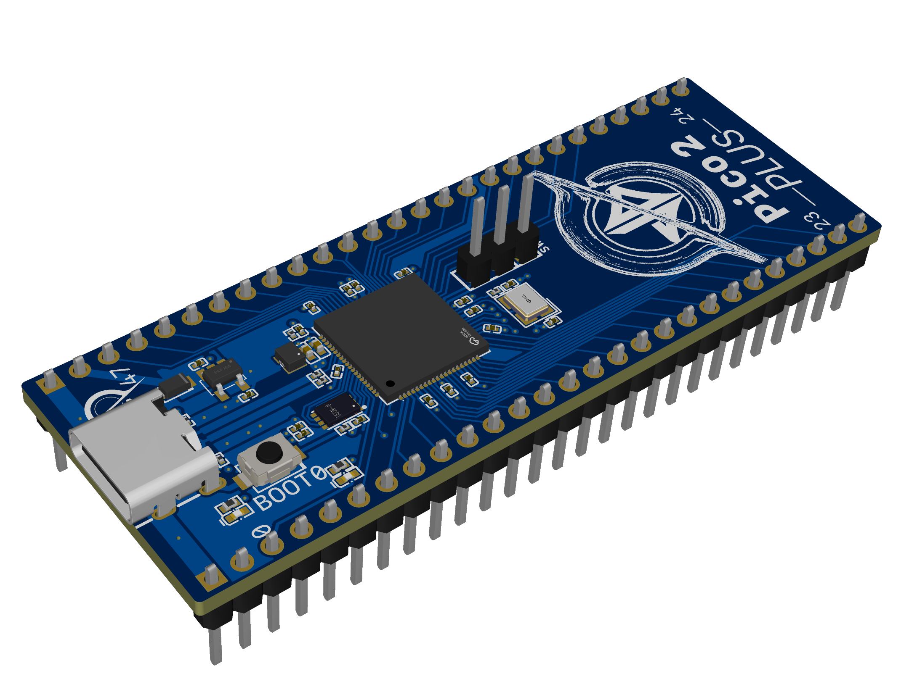
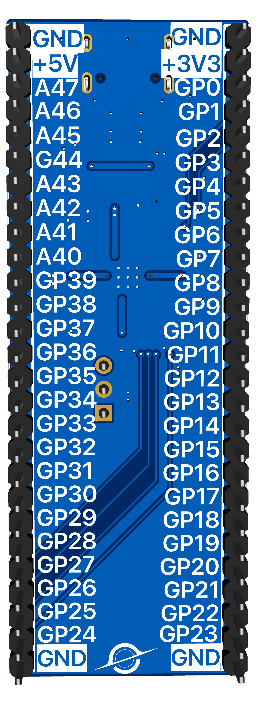

# RPi-Pico-2-Plus
Pico 2+ is a compact, custom PCB built around the RP2350B microcontroller, designed to break out all GPIO pins for maximum flexibility. It keeps the familiar Raspberry Pi Pico form factor but adds a more developer-friendly layout — giving access to every feature of the RP2350B including dual cores, PIO, ADC, and full-speed USB-C.

# Images

# Features
- 🧠 Powered by RP2350B — dual-core ARM Cortex-M33 + Dual-core Hazard3 RISC-V
- 🔌 USB-C — works everywhere!
- 💾 On-board 2MB of compact flash
- 🌈 LED at GPIO-0

# Getting Started
1. Order the PCB.
2. Plug it to your laptop
3. Use it as a normal RPi Pico but with more GPIOs 

> Feel free to fork, push or give any suggestions
